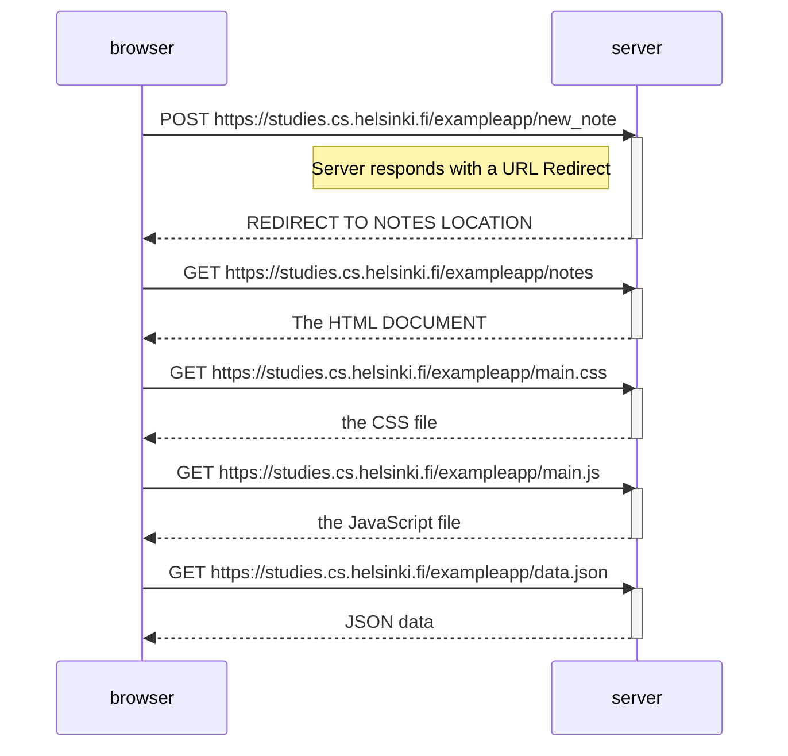
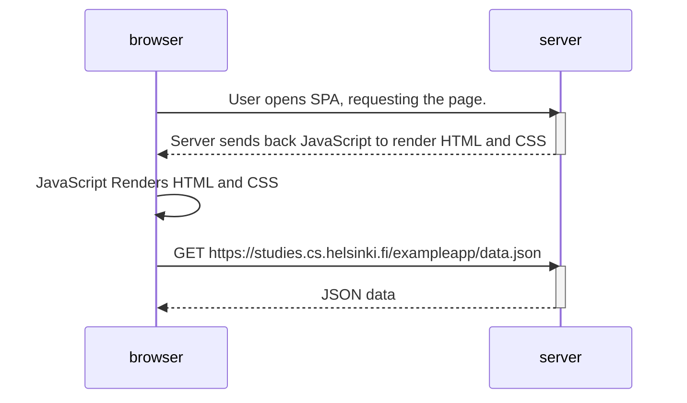

#Exercise 0.4

```mermaid
sequenceDiagram
    participant browser
    participant server

    browser->>server: POST https://studies.cs.helsinki.fi/exampleapp/new_note
    activate server
    Note left of server: Server responds with a URL Redirect
    server-->>browser: REDIRECT TO NOTES LOCATION
    deactivate server

    browser->>server: GET https://studies.cs.helsinki.fi/exampleapp/notes
    activate server
    server-->>browser: The HTML DOCUMENT
    deactivate server

    browser->>server: GET https://studies.cs.helsinki.fi/exampleapp/main.css
    activate server
    server-->>browser: the CSS file
    deactivate server

    browser->>server: GET https://studies.cs.helsinki.fi/exampleapp/main.js
    activate server
    server-->>browser: the JavaScript file
    deactivate server

   

    browser->>server: GET https://studies.cs.helsinki.fi/exampleapp/data.json
    activate server
    server-->>browser: JSON data
    deactivate server
```

#Exercise 0.5

```mermaid
sequenceDiagram
    participant browser
    participant server

    browser->>server: User opens SPA, requesting the page.
    activate server
    server-->>browser: Server sends back JavaScript to render HTML and CSS
    deactivate server

    browser->>browser: JavaScript Renders HTML and CSS

   

    browser->>server: GET https://studies.cs.helsinki.fi/exampleapp/data.json
    activate server
    server-->>browser: JSON data
    deactivate server
```